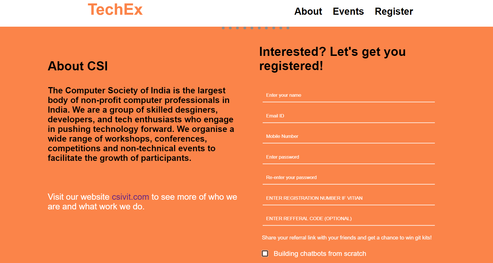
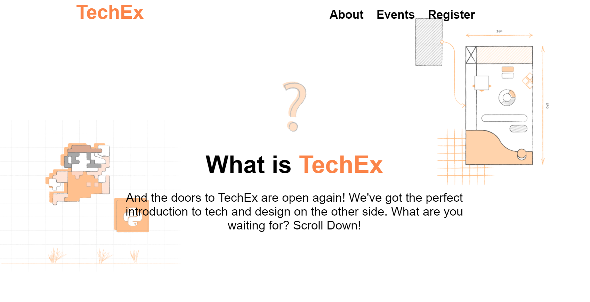

[![csivit][csivitu-shield]](https://github.com/csivitu)
[![Issues][issues-shield]](https://github.com/csivitu/TechEx-Backend/issues)

<!-- PROJECT LOGO -->
<br />
<p align="center">
  <a href="https://github.com/github_username/repo">
    
  </a>

  <h3 align="center">TechEx Backend</h3>

  <p align="center">
    Backend for the TechEx website
    <br />
    <a href="https://github.com/csivitu/repo"><strong>Explore the docs »</strong></a>
    <br />
    <br />
    <a href="https://github.com/csivitu/repo">View Demo</a>
    ·
    <a href="https://github.com/csivitu/repo/issues">Report Bug</a>
    ·
    <a href="https://github.com/csivitu/repo/issues">Request Feature</a>
  </p>
</p>


<!-- TABLE OF CONTENTS -->
## Table of Contents

* [About the Project](#about-the-project)
  * [Built With](#built-with)
* [Getting Started](#getting-started)
  * [Prerequisites](#prerequisites)
  * [Installation](#installation)
* [Usage](#usage)
* [Roadmap](#roadmap)
* [Contributing](#contributing)
* [License](#license)
* [Contributors](#contributors-)


<!-- ABOUT THE PROJECT -->
## About The Project

TechEx, CSIVIT's annual workshop series was conducted this year but amidst the corona virus pandemic, it had to be held online. This project is the backend for the website used for TechEx registrations. We provide functionality for signing up as well as referral codes were implemented. 


### Built With

* [Node](https://nodejs.org/en/)
* [ExpressJs](https://expressjs.com/)
* [MongoDB](https://www.mongodb.com/)


<!-- GETTING STARTED -->
## Getting Started

To get a local copy up and running follow these simple steps.

### Prerequisites

* npm
```sh
npm install npm@latest -g
```

### Installation
 
1. Clone the repo
```sh
git clone https://github.com/csivitu/TechEx-Backend
```
2. Install NPM packages
```sh
npm install
```


<!-- USAGE EXAMPLES -->
## Usage

<p align="center">
  
  <br />
  <br />
  
</p>


<!-- ROADMAP -->
## Roadmap

See the [open issues](https://github.com/csivitu/TechEx-Backend/issues) for a list of proposed features (and known issues).


<!-- CONTRIBUTING -->
## Contributing

Contributions are what make the open source community such an amazing place to be learn, inspire, and create. Any contributions you make are **greatly appreciated**.

1. Fork the Project
2. Create your Feature Branch (`git checkout -b feature/AmazingFeature`)
3. Commit your Changes (`git commit -m 'feat: Add some AmazingFeature'`)
4. Push to the Branch (`git push origin feature/AmazingFeature`)
5. Open a Pull Request

You are requested to follow the contribution guidelines specified in [CONTRIBUTING.md](./CONTRIBUTING.md) while contributing to the project :smile:.

<!-- LICENSE -->
## License

Distributed under the MIT License. See [`LICENSE`](./LICENSE) for more information.


<!-- MARKDOWN LINKS & IMAGES -->
<!-- https://www.markdownguide.org/basic-syntax/#reference-style-links -->
[csivitu-shield]: https://img.shields.io/badge/csivitu-csivitu-blue
[csivitu-url]: https://csivit.com
[issues-shield]: https://img.shields.io/github/issues/othneildrew/Best-README-Template.svg?style=flat-square
[issues-url]: (https://github.com/csivitu/TechEx-Backend/issues)
